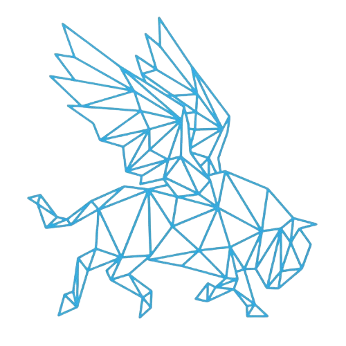

<p align="center">
  
</p>

# TFOTB - The Flight of The Buffalo

Hackathon submission (Hack-Nation Challenge 05). An evidence-backed rare-disease connection explorer, plus a bounded MuJoCo simulation of a lab liquid-handling workflow.
**Research support only. Not a clinical system.** No diagnosis, dosing, eligibility or treatment advice. Spec: [`docs/PLAN.md`](docs/PLAN.md). Task status: [`docs/BACKLOG.md`](docs/BACKLOG.md). Why things are the way they are: [`docs/DECISIONS.md`](docs/DECISIONS.md). Independent audit of this repository: [`QUALITY_AUDIT.md`](QUALITY_AUDIT.md) and [`REQUIREMENTS_TRACEABILITY.md`](REQUIREMENTS_TRACEABILITY.md).

## What it does
1. **Finds how rare diseases connect.** For a disease it lists related diseases and says how strong the evidence is. The label is the evidence category: *reviewed mechanistic lead*, *literature-supported lead*, *symptom-level lead*, *hypothesis only*, *conflicting evidence* or *insufficient coverage*. There is no combined score and no probability. Related diseases come from shared symptoms (HPO), shared genes (HPO) and shared features in claims read from papers.
2. **Looks up terms nobody has searched for.** A disease, symptom or other medical term the catalogue lacks is checked against NLM MeSH and Europe PMC (no AI, no cost). If it is verifiable it is added to the shared catalogue with the papers found, as a catalogue entry and not as evidence; if not, it stays on the visitor's own device and is labelled unverified. Anything that looks like a personal identifier is refused.
3. **Works from symptoms when no disease is named.** `/symptoms` turns described symptoms into HPO terms and lists candidate diseases and their linked genes. These are research hypotheses, not diagnoses.
4. **Reads the literature by itself.** It finds credible papers (PubMed-indexed journal articles with open-access full text; preprints, retractions and editorials are rejected), has an AI model propose claims, and keeps a claim only if its quote appears word for word in the paper, the quote names what the claim is about, and its names resolve to real ontology IDs. Every claim cites the paper's own DOI link.
5. **Makes hypotheses and says so.** The AI may propose links no paper states. These are always labelled "AI hypothesis, not a finding", must cite stored claims from at least two different papers, and never count as evidence or change an evidence category.
6. **Shows where everything came from.** Nothing needs human review to be displayed. Each claim says whether it was found by AI in a named article, is an AI hypothesis, or came from a database, and whether anyone reviewed it.
7. **Separates independent studies from background.** A paper that only cites a fact as already known adds a little weight, shown as its own number, but is not counted as an independent study.
8. **Shows contradictions.** Opposing effect directions on a shared feature produce the *conflicting evidence* category and name both claims. (No real contradiction has been found in the stored papers yet; the behaviour is tested on synthetic claims.)
9. **Says when it found nothing.** A gap is dated and limited to the indexed evidence. It never says "no connection exists".
10. **Shows who works on it.** The collaborator view lists authors of the papers behind the stored claims and who also appears on papers about other diseases. Matches are by ORCID where the record has one, otherwise by name only (labelled unverified). It is not a contact route.
11. **Groups diseases around a search.** The Clusters page shows the groups the searched disease belongs to: a shared observed mechanism (same compartment and substance), a shared gene, a direct link from a paper (a hypothesis), and similar symptoms, each with the claims behind it. It is an organisation of the evidence under a stated rule, not a validated clustering and not a claim of shared treatment.
12. **Simulates a workflow check.** A MuJoCo model checks a proposed plate-preparation sequence for resource and motion failures. A pass says nothing about biology.

## How TFOTB uses OpenAI
Every model call goes through one adapter, `src/atlas/llm/openai_client.py` (Chat Completions with strict structured output, `response_format: json_schema, strict: true`). Model names come from `OPENAI_MODEL_FAST` and `OPENAI_MODEL_REASONING`; each stored claim records the model and prompt that produced it (`extraction_method`), and every response is cached so a rerun replays it at no cost.

| Job | Model | What OpenAI does | What code does afterwards |
|---|---|---|---|
| **Extract** claims from papers | `OPENAI_MODEL_FAST` (GPT-5 mini) | Reads the open-access full text of a PubMed-indexed article and proposes typed statements (gene-disease, accumulation in a compartment, shared pathway, treatment idea), each with a verbatim quote | Keeps a statement only if the quote is in the paper word for word, names both entities, is not negated, and both names resolve to MONDO / HGNC / HPO / GO / ChEBI IDs. Everything else is quarantined with its reason |
| **Hypothesise** across papers | `OPENAI_MODEL_REASONING` (GPT-5) | Proposes links no single paper states | Accepts one only if it cites stored claims from at least two different papers and names only known entities; it is always labelled "AI hypothesis, not a finding" and never changes an evidence category |
| **Review** an overnight experiment run | `OPENAI_MODEL_REASONING` | Chooses the next change after a failed run | The choice must be one the researcher's rules allow, within range; it is re-checked, and the server caps AI reviews per hour |
| **Research on demand** (`POST /api/research`) | both | Runs discovery and extraction for a topic or a disease | Same checks as above; needs a token, rate-limited per hour |

**Running now.** Every claim in the store and in the deployed app was read by an OpenAI model, and the hypotheses were generated by one. The deployed API runs the experiment AI review live (capped per hour) and the token-protected research endpoint. Spending is bounded by [`config/ingest_policy.json`](config/ingest_policy.json) (papers per run, characters per paper, output tokens per call) and by a hard cap on the OpenAI account.

**What more OpenAI credits would unlock.**
- **Coverage.** Only papers that have been read contribute claims; most rare diseases (Fabry disease, for example) have none yet and are shown from reference data alone. Credits buy reading the open-access literature for every watched disease, not only the CLN3 / Niemann-Pick type C seed cluster.
- **A weekly reading job.** The pipeline already finds new papers by itself (`scripts/ingest_papers.py`); running it on a schedule for all diseases is built in but switched off, because it is too expensive on the current budget.
- **A second, independent reading.** Reading each paper with both models and storing only statements they agree on would attack the main weakness stated below: the checks prove a quote exists, not that it was read correctly.
- **Reconcile and Explain.** Model-suggested synonyms for names that failed to resolve (checked against the ontologies before use), and plain-language explanations of a graph path for families, each step citing its claim.
- **Research for every visitor.** Opening on-demand research to all users instead of token holders.

## Architecture
```
 reference files (MONDO, HGNC, HPO, GO, ChEBI; pinned, SHA-256 checked)
        |                                   Europe PMC (PubMed-indexed, open-access full text)
        v                                           |
  resolver (names -> stable IDs;                    v
  unresolved stays unresolved)        discovery -> fetch -> AI extraction -> checks (quote verbatim, quote names the
        |                                              entities, no negation, human evidence only, IDs resolve)
        |                                                          |
        |                                                          v
        |                                       claim store (SQLite + checksummed snapshot; immutable, 'unreviewed')
        v                                                          |
  evidence channels (phenotype similarity; claim-overlap: genes, mechanisms, RNA, findings) <------------------+
        |   (a new channel declares its kind; no ranking edit needed)
        v
  T09 gates: evidence category, contradictions, independent studies vs background, gaps with coverage
        |                                   |                                   |
        v                                   v                                   v
  action cards (templates,      graph + routes + clusters           collaborators, symptoms search
  every footnote -> a claim)    (every edge = one claim)            (authors as listed; HPO-based)
        |
        v
  FastAPI (src/atlas/api)  ->  web app (frontend/, React SPA)         AI hypotheses (grounded in stored claims)
        ^
        |  POST /lookup: a term nobody has searched before is checked against NLM MeSH and Europe PMC;
        |  verified -> shared term store (with its papers), not verified -> kept in the visitor's browser only
```
Details: [`docs/implementation/02-architecture.md`](docs/implementation/02-architecture.md). The model proposes, code disposes: no model output is stored unless code verifies it.

## Verify it yourself
| Claim | How to check |
|---|---|
| The test suite passes | `make test` and `make lint` (see `QUALITY_AUDIT.md` for the count on the audit date) |
| The reference data is the pinned version | `python scripts/fetch_ontologies.py` re-verifies every file against `data/raw/CHECKSUMS.json` |
| Claims carry real citations and verbatim quotes | Open any paper-derived claim in the evidence drawer (it links the article and shows the quote), or run `scripts/ingest_papers.py --pmids 37245481` with an API key and inspect `data/store/`. Recorded model responses are not committed, so a run without a key makes no claims. |
| The seed connection works end to end | `PYTHONPATH=src python -m pytest tests/test_paper_claims_in_ranking.py -q` (real-data test; needs the reference files and skips without them) |
| The simulation fails when it should | `cd robotics && python simulate.py fixtures/blocked_path.json --out ../demo_outputs` (expect: fail) |

## Quick start (any machine)
Toolchain is pinned in `mise.toml` (Python 3.12, Node 22; the web app uses npm). Install [mise](https://mise.jdx.dev) once, then:

```bash
git clone https://github.com/djang-c/TFOTB.git && cd TFOTB
mise trust && make setup   # tools, .venv from requirements.lock, frontend deps, .env from env.example (all keys optional)
make test                  # pytest (atlas + robotics + API)
make dev                   # API :8000 + web :3000
```
Real reference data (about 440 MB, git-ignored) is downloaded with `python scripts/fetch_ontologies.py`. Without it the app runs on the clearly labelled SYNTHETIC demo data only.

### Reading papers (needs an API key in `.env`)
```bash
PYTHONPATH=src python scripts/ingest_papers.py --dry-run                     # what it would read; spends nothing
PYTHONPATH=src python scripts/ingest_papers.py                               # discover and read new papers
PYTHONPATH=src python scripts/ingest_papers.py --query "Niemann-Pick type C" # research a topic now
PYTHONPATH=src python scripts/backfill_papers.py && python scripts/backfill_labels.py  # authors and names for the views above
PYTHONPATH=src python scripts/generate_hypotheses.py                         # AI hypotheses from stored claims
```
What may run unattended, and how many papers per run, is set in [`config/ingest_policy.json`](config/ingest_policy.json). The model provider is OpenAI (`OPENAI_API_KEY`, `OPENAI_MODEL_FAST`, `OPENAI_MODEL_REASONING` in `.env`; `python scripts/check_openai_key.py` lists the models a key can use). `bash scripts/reread_with_openai.sh` re-reads every stored paper into a fresh store and repackages `deploy/store`. Without a key nothing is sent and no paid call is made (it can only replay responses you recorded yourself). The API endpoint `POST /api/research` does the same on demand; it is off unless `RESEARCH_ENABLED=true` and `RESEARCH_TOKEN` is set.

### Simulation
```bash
cd robotics
python simulate.py fixtures/valid_transfer.json --out ../demo_outputs      # expect: pass
python simulate.py fixtures/blocked_path.json --out ../demo_outputs        # expect: fail (intended)
```
Optional replay video: `MUJOCO_GL=glfw python render_replay.py ../demo_outputs/valid_transfer.trajectory.json ../demo_outputs/valid_transfer.replay.mp4` (needs OpenGL/GLFW and ffmpeg; not verified on a clean machine).

## Limits, stated plainly
- **No expert has reviewed any biological claim.** Labels, not review, are the protection. A reviewer can upgrade a claim's label; none has.
- **PubMed indexing is a proxy for peer review.** The code checks the paper's own record (a journal article, not a preprint, retraction or editorial). It does not verify peer review itself.
- **The AI can be wrong.** The checks prove the quote exists in the paper, names the entities, and is not negated. They do not prove the AI read it correctly: an independent audit of an earlier version found about 10% of stored claims wrong and another 15% partly wrong before these checks were tightened, and the tightened version has not been re-sampled. The "new finding versus background" label is also the AI's judgement.
- **The symptom-similarity and symptom-search numbers are shares of recorded annotations, not probabilities, and have not been validated against any ground truth.**
- **Small evidence base.** The seed cluster is CLN3 disease and Niemann-Pick type C. Results outside it come mostly from public reference files and are mostly symptom-level.
- **Not built:** variant-level evidence (no OMIM, ClinVar, transcript or genome-build handling), free-text research-question answering, funders and NIH RePORTER, patient-organisation directories other than GARD, any validated clustering, a measured 10x result, a recorded video. See `QUALITY_AUDIT.md` for the full list.
- **The web app** type-checks, lints, builds, passes its unit tests and a headless-Chrome smoke test against the real API (see `frontend/README.md`). It has not been checked on other browsers or with a screen reader.
- **Licences.** This is a hackathon project, not a commercial use. Any open-access paper may be read; each paper's licence is recorded in the run log. HPO's commercial terms are unresolved (see `data/manifests/source_manifest.md`). Revisit all of this before any commercial use.
- **The simulation is a geometry and resource check.** No liquids, hardware, calibration or biology are modelled.

## Layout
`src/atlas/` engine (the Python package is still named `atlas`) · `frontend/` explorer UI · `config/` standing ingest policy · `scripts/` data and pipeline scripts · `robotics/` scene, schema, fixtures, compiler, simulator, replay · `tests/` · `data/manifests/` source audit · `docs/` plan, decisions, backlog, deploy notes, audit working files.
